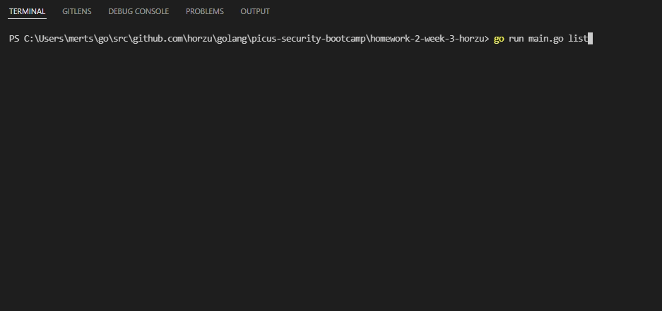
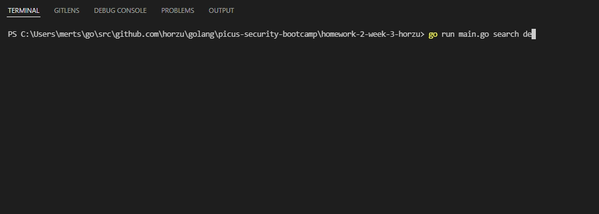
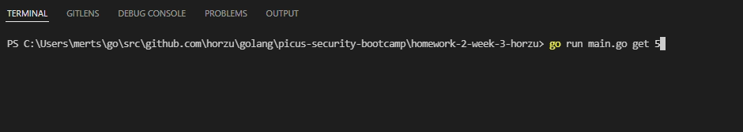
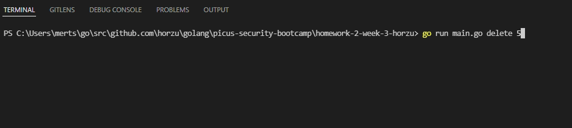
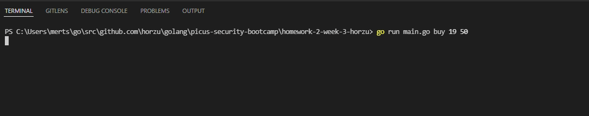

# CommandMe2 App

A simple terminal app that executes given commands.

## Table of Contents

* [Setup](#setup)
* [Usage](#usage)
* [Screenshots](#screenshots)
* [Contact](#contact)
* [License](#license)

Concurrency Medium Link: [Concurrentcy in Golang](https://medium.com/@mertakar_22051/concurrency-in-golang-d49d2db1ed91)

## Setup

To run this project you must have Golang installed in your PC.

## Usage

We have a book list. It has fields as below:

```dash
- Book ID
- Book Title
- Page Number
- Stock Quantity
- Price
- Stock Code
- ISBN
- Author Info (ID and Name)
```

There are 5 commands you can write after running the main.go file:

* list: Lists all books that system has.
* search: Searches given book. If given book is in the list returns book's name, otherwise returns info about that book is not in the list.
* get: Gets book information of given id.
* delete: Sets stock of given id's book as 0. It will be not in the list but you can get the information of the book with get command.
* buy: Buys given quantity of the given book and returns the new state of the book.

### list command

```go
go run main.go -list
```

### search command

```go
go run main.go -search <bookName>
go run main.go -search Lord
```

### get command

```go
go run main.go -get <bookID>
go run main.go -get 5
```

### delete command

```go
go run main.go -delete <bookID>
go run main.go -delete 5
```

### buy command

```go
go run main.go -buy <bookID> <quantity>
go run main.go -buy 5 10
```

## Screenshots

* "-list" command


---

* "-search" command


---

* "-get" command


---

* "-delete" command


---

* "-buy" command


---

## Contact

Created by [@horzu](https://horzu.github.io/) - feel free to contact me!

## License

[MIT](https://choosealicense.com/licenses/mit/)
